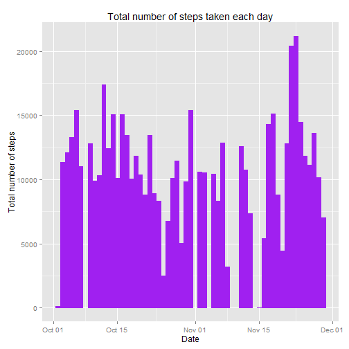
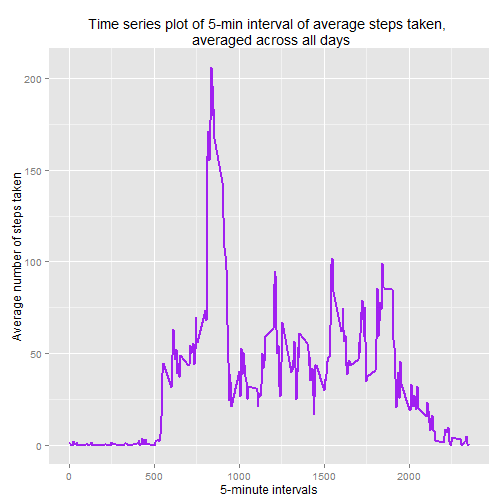
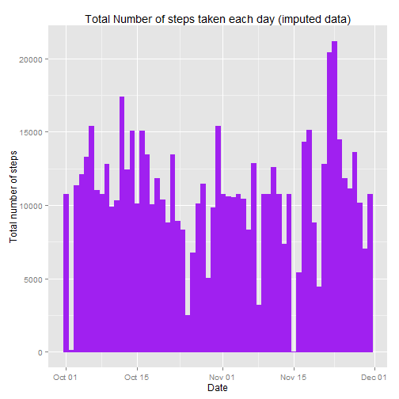
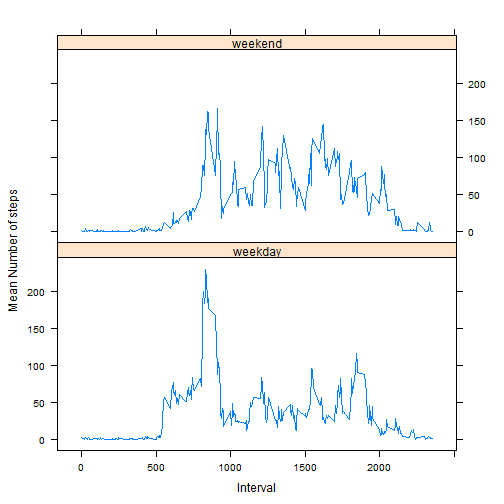

## Loading and preprocessing the data

```r
setwd("C:/Data_wd/RR/coursework1_submission")
unzip("activity.zip")
data = read.csv("activity.csv",colClasses=c("integer","Date","integer"))
head(data)
```

```
##   steps       date interval
## 1    NA 2012-10-01        0
## 2    NA 2012-10-01        5
## 3    NA 2012-10-01       10
## 4    NA 2012-10-01       15
## 5    NA 2012-10-01       20
## 6    NA 2012-10-01       25
```

```r
library(ggplot2)

datanoNA = na.omit(data)
head(datanoNA)
```

```
##     steps       date interval
## 289     0 2012-10-02        0
## 290     0 2012-10-02        5
## 291     0 2012-10-02       10
## 292     0 2012-10-02       15
## 293     0 2012-10-02       20
## 294     0 2012-10-02       25
```

## What is mean total number of steps taken per day?

1. Make a histogram of total number of steps taken for each day


```r
dataagg = aggregate(steps ~ date, data=datanoNA, FUN="sum")
head(dataagg)
```

```
##         date steps
## 1 2012-10-02   126
## 2 2012-10-03 11352
## 3 2012-10-04 12116
## 4 2012-10-05 13294
## 5 2012-10-06 15420
## 6 2012-10-07 11015
```

```r
ggplot(dataagg, aes(date,steps)) + 
  labs(title="Total number of steps taken each day",x="Date", y="Total number of steps") +
  geom_bar(stat = "identity", color="purple", fill="purple")
```

 

2. Calculate and report the mean and median total number of steps taken per day

Mean steps taken per day:

```r
meanstepsdf = aggregate(steps~date,data=datanoNA, FUN="mean")
head(meanstepsdf)
```

```
##         date    steps
## 1 2012-10-02  0.43750
## 2 2012-10-03 39.41667
## 3 2012-10-04 42.06944
## 4 2012-10-05 46.15972
## 5 2012-10-06 53.54167
## 6 2012-10-07 38.24653
```

Median steps taken per day:

```r
medianstepsdf = aggregate(steps~date,data=datanoNA, FUN="median")
head(medianstepsdf)
```

```
##         date steps
## 1 2012-10-02     0
## 2 2012-10-03     0
## 3 2012-10-04     0
## 4 2012-10-05     0
## 5 2012-10-06     0
## 6 2012-10-07     0
```

Mean steps for all days:

```r
o_mean=mean(dataagg$steps)
o_mean
```

```
## [1] 10766.19
```

Median steps for all days:


```r
o_median=median(dataagg$steps)
o_median
```

```
## [1] 10765
```

## What is the average daily activity pattern?
1. Make a time series plot (i.e. type = "l") of the 5-minute interval (x-axis) and the average number of steps taken, averaged across all days (y-axis)


```r
avgSteps <- aggregate(steps~interval, data=datanoNA, FUN="mean")
head(avgSteps)
```

```
##   interval     steps
## 1        0 1.7169811
## 2        5 0.3396226
## 3       10 0.1320755
## 4       15 0.1509434
## 5       20 0.0754717
## 6       25 2.0943396
```

```r
names(avgSteps)[2] <- "meanSteps"
head(avgSteps)
```

```
##   interval meanSteps
## 1        0 1.7169811
## 2        5 0.3396226
## 3       10 0.1320755
## 4       15 0.1509434
## 5       20 0.0754717
## 6       25 2.0943396
```

```r
ggplot(avgSteps, aes(interval, meanSteps)) + geom_line(color = "purple", size = 1.0) + labs(title = "Time series plot of 5-min interval of average steps taken, \n averaged across all days", x = "5-minute intervals", y = "Average number of steps taken")
```

 

2. Which 5-minute interval, on average across all the days in the dataset, contains the maximum number of steps?


```r
avgSteps[avgSteps$meanSteps == max(avgSteps$meanSteps), ]$interval
```

```
## [1] 835
```

## Imputing missing values
1. The total number of missing values in the dataset:


```r
sum(is.na(data))
```

```
## [1] 2304
```

2. Devise a strategy for filling in all of the missing values in the dataset. The strategy does not need to be sophisticated. For example, you could use the mean/median for that day, or the mean for that 5-minute interval, etc.

Strategy: To use the mean steps of the 5-minute interval to fill each NA in steps column if interval matches.

3. Create a new dataset that is equal to the original dataset but with the missing data filled in.


```r
newData <- data 
for (i in 1:nrow(newData)) {
    if (is.na(newData$steps[i])) {
        newData$steps[i] <- avgSteps[which(newData$interval[i] == avgSteps$interval), ]$meanSteps
    }
}

head(newData)
```

```
##       steps       date interval
## 1 1.7169811 2012-10-01        0
## 2 0.3396226 2012-10-01        5
## 3 0.1320755 2012-10-01       10
## 4 0.1509434 2012-10-01       15
## 5 0.0754717 2012-10-01       20
## 6 2.0943396 2012-10-01       25
```

```r
sum(is.na(newData))
```

```
## [1] 0
```


4. Make a histogram of the total number of steps taken each day and Calculate and report the mean and median total number of steps taken per day. 


```r
dataagg2 = aggregate(steps~date, data=newData, FUN="sum")
head(dataagg2)
```

```
##         date    steps
## 1 2012-10-01 10766.19
## 2 2012-10-02   126.00
## 3 2012-10-03 11352.00
## 4 2012-10-04 12116.00
## 5 2012-10-05 13294.00
## 6 2012-10-06 15420.00
```

```r
ggplot(dataagg2, aes(date, steps)) + 
  labs(title = "Total Number of steps taken each day (imputed data)", x = "Date", y = "Total number of steps") +
  geom_bar(stat = "identity", color="purple", fill="purple") 
```

 

5. Do these values differ from the estimates from the first part of the assignment? What is the impact of imputing missing data on the estimates of the total daily number of steps?

Mean steps taken per day:

```r
meanstepsdf2 = aggregate(steps~date,data=newData, FUN="mean")
head(meanstepsdf2)
```

```
##         date    steps
## 1 2012-10-01 37.38260
## 2 2012-10-02  0.43750
## 3 2012-10-03 39.41667
## 4 2012-10-04 42.06944
## 5 2012-10-05 46.15972
## 6 2012-10-06 53.54167
```

Median steps taken per day:

```r
medianstepsdf2 = aggregate(steps~date,data=newData, FUN="median")
head(medianstepsdf2)
```

```
##         date    steps
## 1 2012-10-01 34.11321
## 2 2012-10-02  0.00000
## 3 2012-10-03  0.00000
## 4 2012-10-04  0.00000
## 5 2012-10-05  0.00000
## 6 2012-10-06  0.00000
```

Mean steps for all days:

```r
newmean = mean(dataagg2$steps)
newmean
```

```
## [1] 10766.19
```

Median steps for all days:

```r
newmedian = median(dataagg2$steps)
newmedian
```

```
## [1] 10766.19
```

Compare them with the two before imputing missing data:

```r
newmean - o_mean
```

```
## [1] 0
```

```r
newmedian - o_median
```

```
## [1] 1.188679
```

After imputing the missing data, the new mean of total steps taken for all days is the same as that of the old mean while the new median of total steps taken for all days is slightly greater than that of the old median.


## Are there differences in activity patterns between weekdays and weekends?
1. Create a new factor variable in the dataset with two levels -- "weekday" and "weekend" indicating whether a given date is a weekday or weekend day.


```r
head(newData)
```

```
##       steps       date interval
## 1 1.7169811 2012-10-01        0
## 2 0.3396226 2012-10-01        5
## 3 0.1320755 2012-10-01       10
## 4 0.1509434 2012-10-01       15
## 5 0.0754717 2012-10-01       20
## 6 2.0943396 2012-10-01       25
```

```r
newData$day = factor(format(newData$date, "%A"))
newData$day_end = factor(format(newData$date, "%A"))
levels(newData$day_end)
```

```
## [1] "Friday"    "Monday"    "Saturday"  "Sunday"    "Thursday"  "Tuesday"  
## [7] "Wednesday"
```

```r
levels(newData$day_end) <- list(weekday = c("Monday", "Tuesday", "Wednesday", "Thursday", "Friday"),
                                 weekend = c("Saturday", "Sunday"))
levels(newData$day_end)
```

```
## [1] "weekday" "weekend"
```

```r
table(newData$day_end)
```

```
## 
## weekday weekend 
##   12960    4608
```

```r
head(newData)
```

```
##       steps       date interval    day day_end
## 1 1.7169811 2012-10-01        0 Monday weekday
## 2 0.3396226 2012-10-01        5 Monday weekday
## 3 0.1320755 2012-10-01       10 Monday weekday
## 4 0.1509434 2012-10-01       15 Monday weekday
## 5 0.0754717 2012-10-01       20 Monday weekday
## 6 2.0943396 2012-10-01       25 Monday weekday
```

2. Make a panel plot containing a time series plot (i.e. type = "l") of the 5-minute interval (x-axis) and the average number of steps taken, averaged across all weekday days or weekend days (y-axis).


```r
newavgSteps = aggregate(steps~interval+day_end, data=newData, FUN="mean") 
head(newavgSteps)
```

```
##   interval day_end      steps
## 1        0 weekday 2.25115304
## 2        5 weekday 0.44528302
## 3       10 weekday 0.17316562
## 4       15 weekday 0.19790356
## 5       20 weekday 0.09895178
## 6       25 weekday 1.59035639
```

```r
names(newavgSteps)[3] <- "meanSteps"
head(newavgSteps)
```

```
##   interval day_end  meanSteps
## 1        0 weekday 2.25115304
## 2        5 weekday 0.44528302
## 3       10 weekday 0.17316562
## 4       15 weekday 0.19790356
## 5       20 weekday 0.09895178
## 6       25 weekday 1.59035639
```

```r
library(lattice)
xyplot(meanSteps ~ interval | day_end, newavgSteps, 
       layout = c(1, 2), type = "l", 
       xlab = "Interval", ylab = "Mean Number of steps")
```

 

